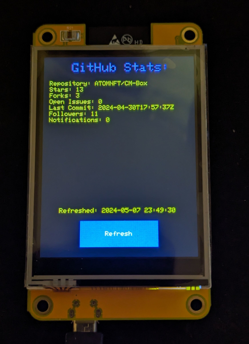
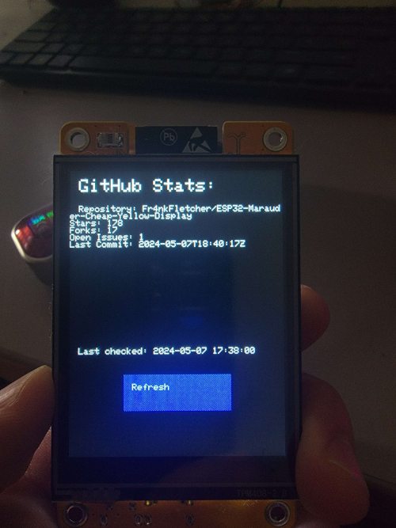

  
# GitHub stats Sketch

<b>Sample project that fetches and displays some basic stat info from a github repo of your choosing. 
 
The data is refreshed every minute or you can manually refresh it with the button on the screen. 
 
The rgb led on the back changes to blue upon a refresh.</b>

## Changing text color/s
If you would like to edit the colors of the text, the following bits of code are where you make these edits.
> void displayStats(String repoName, int stars, int forks, int issues, String lastCommit, int followers, int notificationsCount) {  
  tft.fillScreen(TFT_BLACK); // Clear screen  
  tft.setTextColor(TFT_VIOLET); // Edit for heading color  
  tft.setTextSize(2);  
  tft.setCursor(45, 10);  
  tft.println("GitHub Stats:");  
  tft.setTextColor(TFT_YELLOW); // Edit for stats color
  
### Color choices

- TFT_BLACK       
- TFT_NAVY        
- TFT_DARKGREEN   
- TFT_DARKCYAN    
- TFT_MAROON      
- TFT_PURPLE      
- TFT_OLIVE       
- TFT_LIGHTGREY   
- TFT_DARKGREY    
- TFT_BLUE        
- TFT_GREEN       
- TFT_CYAN        
- TFT_RED         
- TFT_MAGENTA     
- TFT_YELLOW      
- TFT_WHITE       
- TFT_ORANGE      
- TFT_GREENYELLOW 
- TFT_PINK        
- TFT_BROWN       
- TFT_GOLD        
- TFT_SILVER      
- TFT_SKYBLUE     
- TFT_VIOLET    

___     
  
 

 
