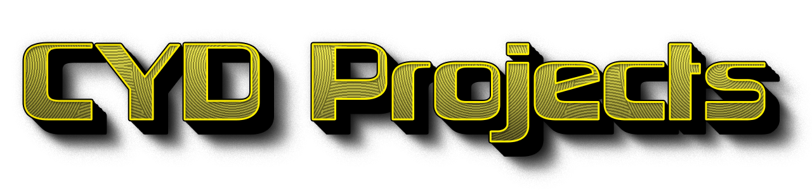

 

<b>Sample projects for the esp32 cheap yellow display.</b>
 
<b>To use arduino IDE with the CYD you must adjust and add a few things to it's enviroment. 
 
Follow <a href=https://github.com/witnessmenow/ESP32-Cheap-Yellow-Display/blob/main/SETUP.md>THIS LINK</a> to setup arduino ide correctly</b>

___

## 📁 Project Directory 📁

- <a href=https://github.com/ATOMNFT/ESP32-CYD-Projects/tree/main/GitHub-Stats>CYD GitHub Stats</a>
  
  

  
### Device Compatibility

These sketches Successfully tested on
- [Amazon\*](https://a.co/d/7d48jB2)
- [Amazon\*](https://a.co/d/aPpfLyP)
- [Aliexpress\*](https://s.click.aliexpress.com/e/_DkSpIjB)
- [Aliexpress\*](https://s.click.aliexpress.com/e/_DkcmuCh)
- [Aliexpress](https://www.aliexpress.com/item/1005004502250619.html)
- [Makerfabs](https://www.makerfabs.com/sunton-esp32-2-8-inch-tft-with-touch.html) - Seems to come with a 16GB SD card.

---

