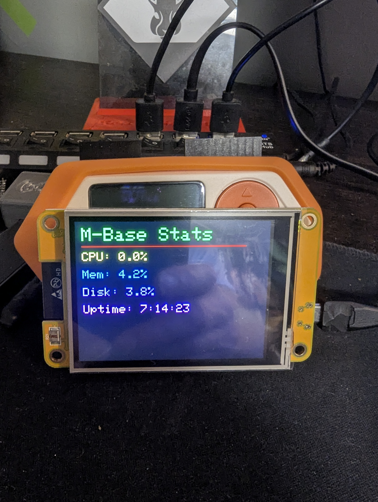
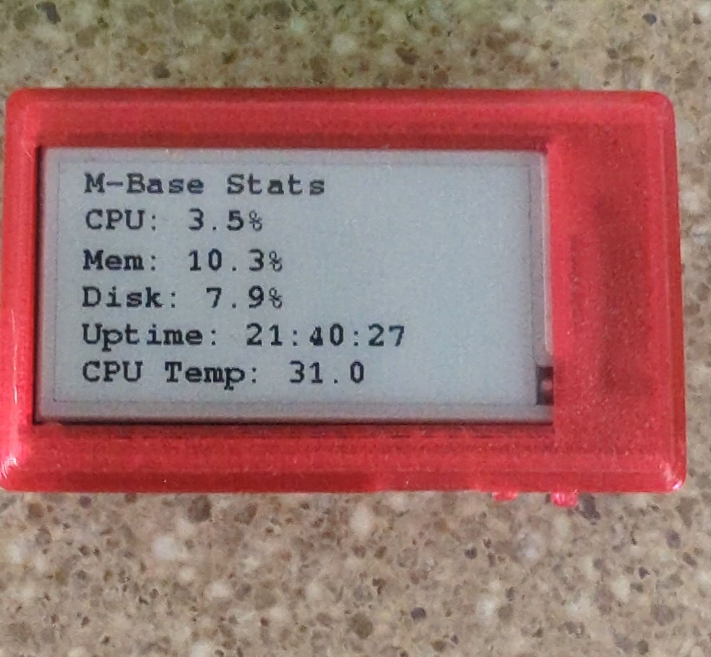

<br>

<div align="center" style="max-width: 100%; overflow: visible;">
  
</div>

---

# ESP32 Server Monitor

## Description
This project allows an ESP32 with a TFT display to fetch system statistics (CPU, memory, disk usage, and uptime) from a Flask-based API running on an Ubuntu server. The data is retrieved over WiFi and displayed on the ESP32's TFT screen.

 

---

## Features
- Monitors CPU, memory, disk usage, and system uptime
- Displays stats on an ESP32 with a TFT screen
- Uses Flask API to serve system data
- Periodically updates data every 5 seconds

---

## Installation & Setup

### Server Setup (Ubuntu)
1. **Install Required Libraries:**
   ```sh
   sudo apt update
   sudo apt install python3 python3-pip
   pip3 install flask psutil
   ```
2. **Create a directory for the server script:**
   ```sh
   mkdir -p ~/server_monitor && cd ~/server_monitor
   ```
3. **Save the `server_stats.py` file:**
   Create and open the file with:
   ```sh
   nano server_stats.py
   ```
   Then copy the Flask script into it and save.
4. **Run the Flask server:**
   ```sh
   python3 server_stats.py
   ```
5. **(Optional) Run as a Service:**
   - Create a systemd service file:
     ```sh
     sudo nano /etc/systemd/system/server_monitor.service
     ```
   - Add the following:
     ```ini
     [Unit]
     Description=Server Monitor API
     After=network.target

     [Service]
     ExecStart=/usr/bin/python3 /path/to/server_stats.py
     WorkingDirectory=/path/to/
     Restart=always
     User=<your-username>

     [Install]
     WantedBy=multi-user.target
     ```
     Replace `/path/to/` with the actual directory where `server_stats.py` is stored and `<your-username>` with the appropriate user running the script.
   - Reload systemd and enable the service:
     ```sh
     sudo systemctl daemon-reload
     sudo systemctl enable server_monitor
     sudo systemctl start server_monitor
     ```

### ESP32 Setup
1. **Install Arduino IDE** (if not already installed).
2. **Install Required Libraries:**
   - Install the following libraries in the Arduino IDE:
     - `WiFi.h`
     - `HTTPClient.h`
     - `ArduinoJson.h`
     - `TFT_eSPI` (Make sure to install the version by **Bodmer**)
3. **TFT_eSPI Configuration (if needed)**
   - These files provide arduino the correct pin mapping for the CYD. There is two files for the two versions of the CYD, and a file to set which version your using.
   - Before modifying any library files, **make a backup of your entire library folder** to prevent issues.
   - If your display does not have a `User_Setup.h` and `User_Setup_Select.h`, custom configuration files are provided in the repository under `CYD_User_Setup/`.
   - Copy these files to the correct location within the TFT_eSPI library directory.
4. **Flash the ESP32 Code:**
   - Open the `Server-Stats.ino` file in Arduino IDE.
   - Modify the WiFi credentials and server URL as needed.
   - Upload the sketch to the ESP32.

## Usage
- Once everything is set up:
  - The Flask API will serve stats at `http://<server-ip>:5000/stats`
  - The ESP32 will display the stats on its TFT screen
  - Stats update every 5 seconds

## Troubleshooting
- **ESP32 not displaying data?**
  - Check if the server is running with `systemctl status server_monitor`
  - Ensure the ESP32 is connected to WiFi
  - Verify the server URL in the ESP32 sketch
- **Cannot access Flask API from another device?**
  - Make sure port 5000 is open in the firewall:
    ```sh
    sudo ufw allow 5000/tcp
    ```
  - Restart the service:
    ```sh
    sudo systemctl restart server_monitor
    ```

## License
This project is open-source and available under the MIT License.

